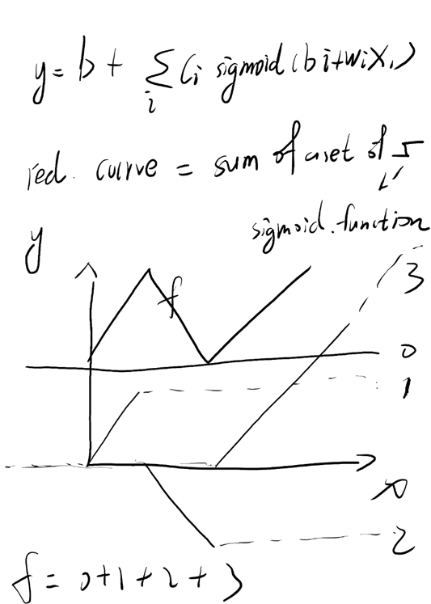
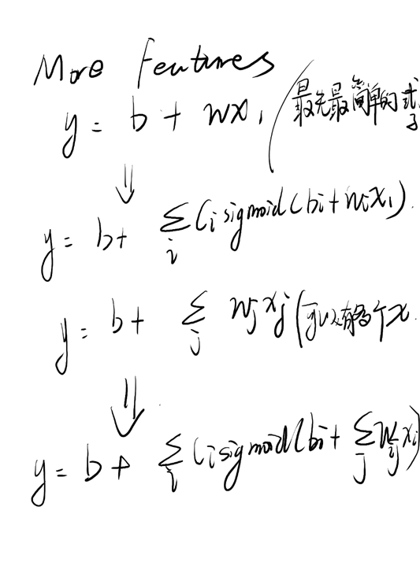
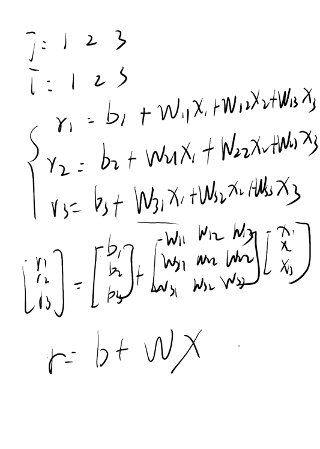
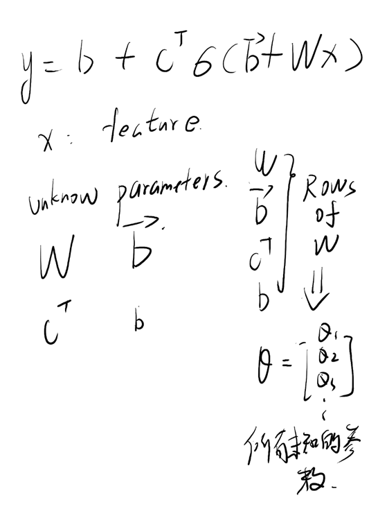
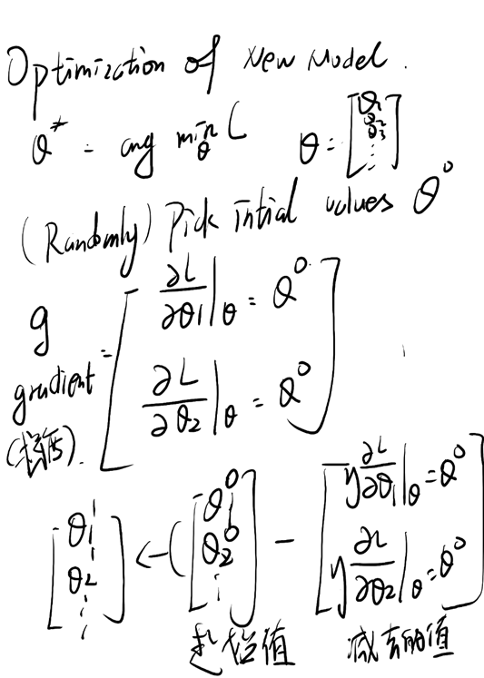
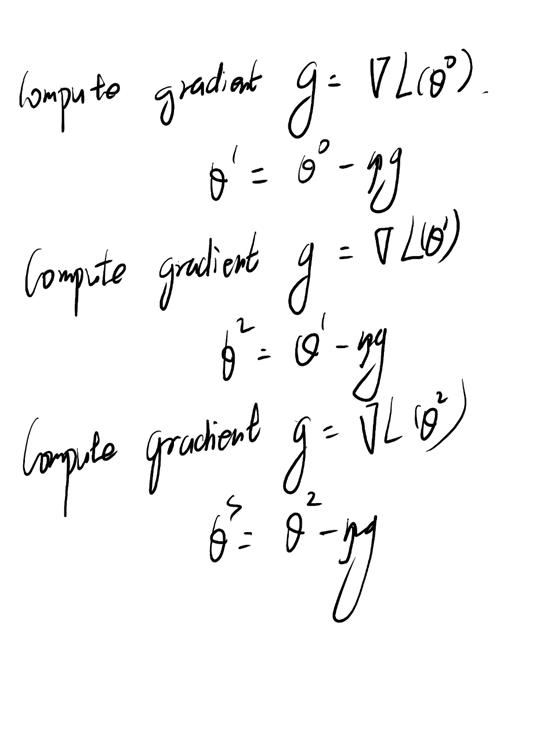
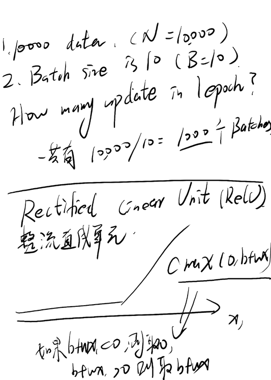
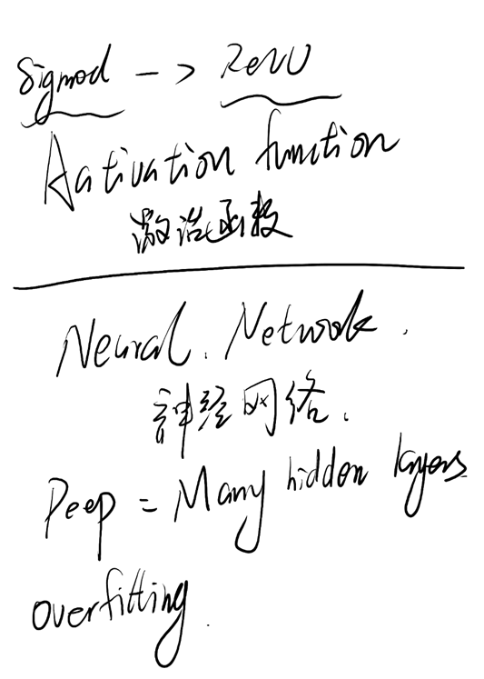

### 机器学习基础下

#### 如何写出一个更复杂的function呢：

#### all piecewise linear curse 全分段线性曲线；

####  sigmoid function 

#### 以上是改写了机器学习的第一步：

#### 重新定了一个未知参数的方程；

#### 其中这个sigmod的数量是可以自己决定的；

#### 第二步（define loss from training data）：

#### 	Loss is  a function of parameters 

#### 	Loss means how good a set of values is.

#### 第三步 Optimization of new model 

#### 	找一组θ，使得loss越小越好；

#### 	随机设置一组数据；

#### 	gradient（梯度）：求出每个参数的微分，根据这个g，迭代计算出下一组参数~

#### 在实际计算中，我们会把数据分成很多的batch，然后分别计算每个batch的L，再根据L计算gradient，使用这个gradient更新参数；

#### 其中，每更新一次参数叫做update,把所有的更新次数都走了一遍，叫做一次epoch

