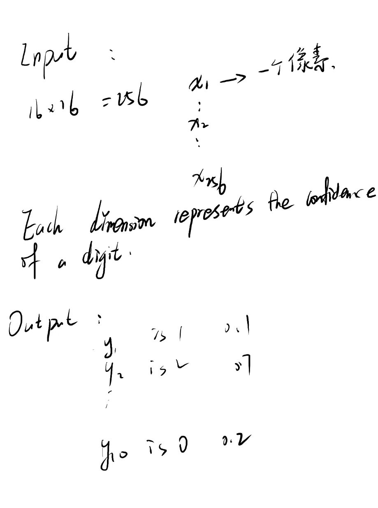

###  Deep Learning 

### Three Steps for Deep Learning

#### Step 1:define a set of  function (neural network):

#### Deep = Many hidden layers

#### Matrix operation 

#### 我们把output layer之前的部分看做是一个：Feature extractor replacing feature engineering (特征提取器取代特征工程);

#### How many layers ? How many neurons for each layer?

#### trail and error(反复试验)   intuition（靠直觉）

#### Can the  structure be automatically determined?

#### 例如：

#### can we design the network stucture ?

#### 例如 ： Convolutional neural network

#### Step2 : goodness of function :

#### Step3: Gradient Descent:

