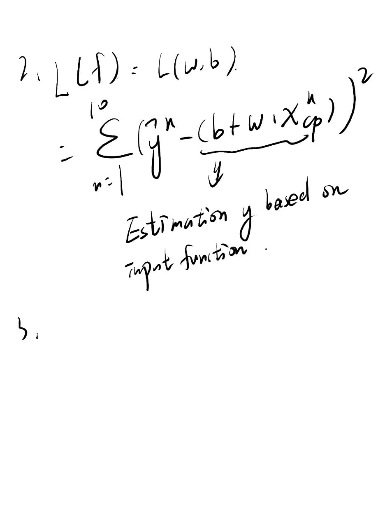
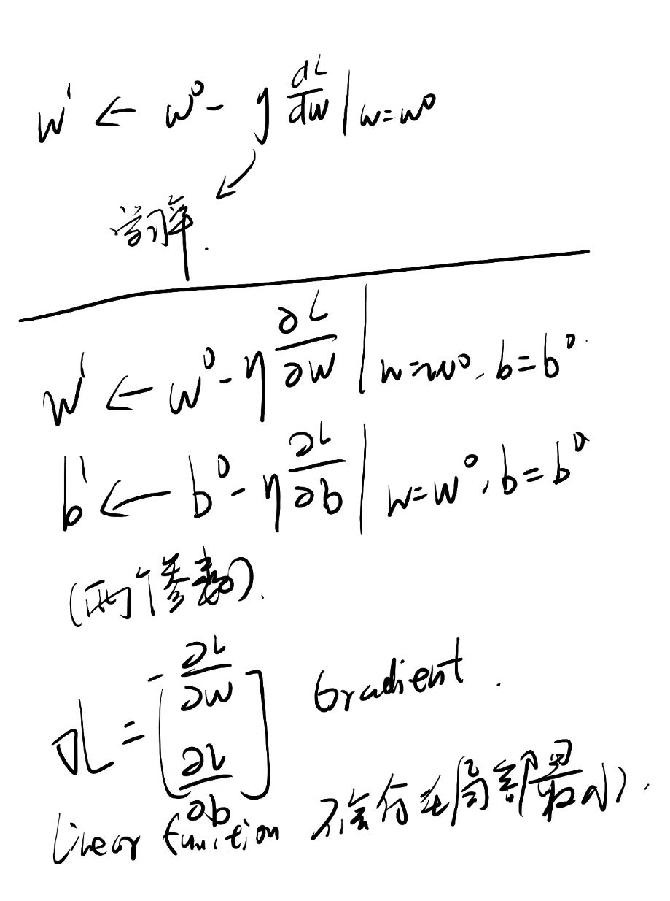
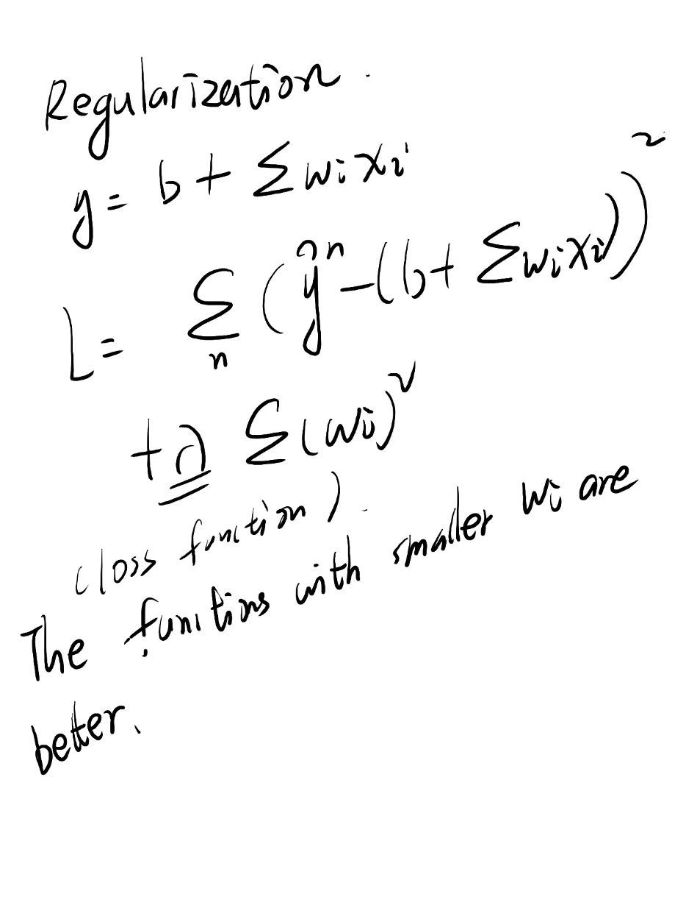

Estimating the combat power(cp) of a pokemon after evolution

输入是某一只宝可梦的信息，输出是宝可梦进化后的cp值；

1.model 

a set of function 

3.使用 gradient descent 方法

consider loss function l(w) with one parameter w:

1.randomly pick an initial value w0；

2.计算 l对参数w的微分；

how about two parameters ?

randomly Pick an initial value w0 b0

真正关注的是 testing data 中的 average error;

2.selecting another model 

引入x的二次方

A more complex modle does not always lead to better performance on testing data.

This is overfitting.

观察图像后发现 函数和物种有关；

regularization

