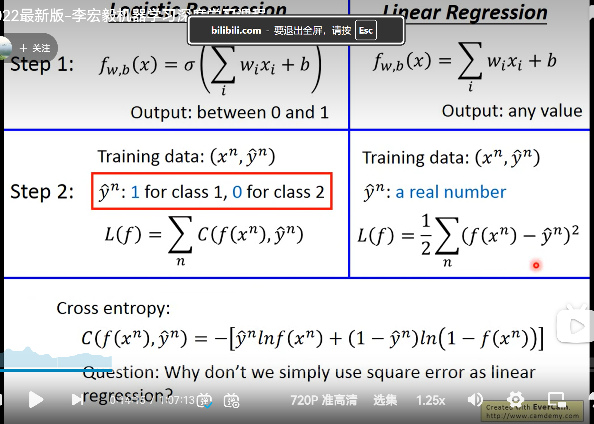

logistic regression(逻辑回归)

step1: function set

step2: goodness of a function

逻辑回归和线性回归的比较：

Benefit of generative model:

with the assumption of probability distribution,less traning data is needed

with the assumption of probability distribution, more robusy to the noise

priors and class-dependent proabilities can be estimated from different sources.

### softmax的定义

假设有一个数组V，V i V_iV 

 表示V中的第i个元素，那么这个元素的softmax值为:

该元素的softmax值，就是该元素的指数与所有元素指数和的比值。

这个定义可以说很简单，也很直观。那为什么要定义成这个形式呢？原因主要如下。
1.softmax设计的初衷，是希望特征对概率的影响是乘性的。
2.多类分类问题的目标函数常常选为cross-entropy。
在神经网络模型中(最简单的logistic regression也可看成没有隐含层的神经网络)
神经网络是用error back-propagation训练的，这个过程中有一个关键的量是∂ L / ∂ α i \partial L / \partial \alpha_i∂L/∂α i
